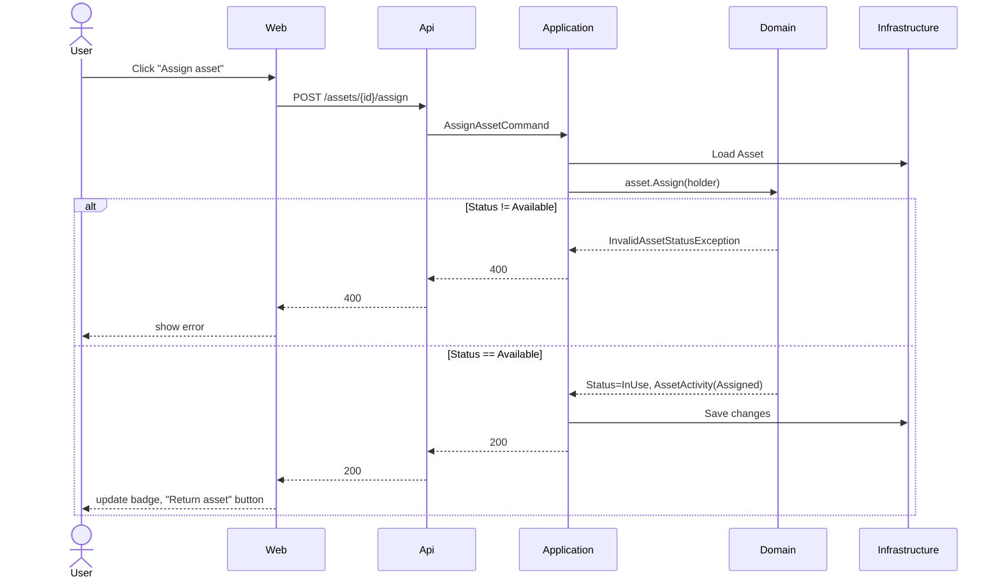

# AssetOps

Internal tool to track shared equipment/assets - status, current holder, and
assignment history. No login, no external dependency beyond the database.

## Apps

- [`apps/api`](apps/api) — ASP.NET Core, Clean Architecture, deployed to Azure Container Apps ([live](https://ca-assetops-api-prod-brs.gentlecliff-429b9963.brazilsouth.azurecontainerapps.io))
- [`apps/web`](apps/web) — React SPA, deployed to Azure Static Web Apps ([live](https://agreeable-rock-00992760f.7.azurestaticapps.net))

## Use cases

- List assets - status dashboard, text search by name/tag, filter by
  status.
- View asset detail - status, holder, full history.
- Create asset.
- Assign asset - fails if not available.
- Return asset - fails if not in use.
- Send asset to maintenance - fails if already in maintenance.
- Return asset from maintenance - fails if not in maintenance.
- Edit asset.
- Retire asset - no hard delete, history kept.
- Search by holder.
- Export inventory as CSV.

### Assign asset, end to end

The one use case with a real invariant - the rest is CRUD.

## Infra

Shared with other apps in the same Azure subscription, to keep cost
marginal per app: one Resource Group, one
Container Apps Environment, one SQL Server.

Created specifically for AssetOps: the Container App, the Static Web App, a database, and a federated credential
(OIDC, scoped to this repo).
