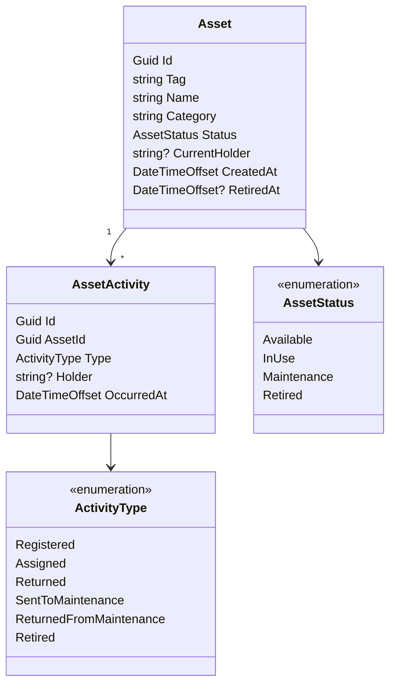
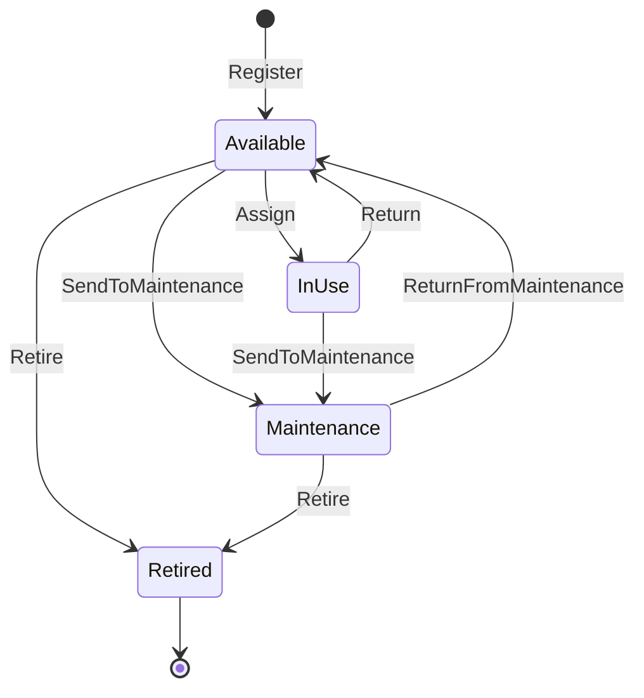

# AssetOps API

## Architecture

Clean Architecture:

- `Domain` - entities, invariants, domain events.
- `Application` - use cases.
- `Infrastructure` - persistence.
- `Api` - HTTP layer, Minimal API.

## Domain model

`AssetActivity` is append-only - it's the detail page's history list.

Assignment periods (holder + start/end) aren't their own entity - no use
case needs assignment duration, current state lives on `Asset`.

## Stack

- .NET / ASP.NET Core Web API
- .NET Aspire - local orchestration + service defaults
- OpenTelemetry + Serilog
- Scalar - API docs
- xUnit v3 on Microsoft Testing Platform
- Entity Framework Core, SQL Server

## Testing

- Unit - `AssetOps.UnitTests`, domain/application logic in isolation.
- Integration - `AssetOps.IntegrationTests`, via `WebApplicationFactory`
  (real HTTP pipeline, in-process).

## CI/CD

Path-filtered to `apps/api` - only runs when this app changes.

- CI (PR) - format check, unit tests, integration tests, SonarCloud
  quality gate (coverage, bugs, vulnerabilities).
- CD (merge to `main`) - same checks, then builds a Docker image, pushes
  to GHCR tagged by commit SHA, deploys to the Container App by immutable
  image digest. Azure login via OIDC.
